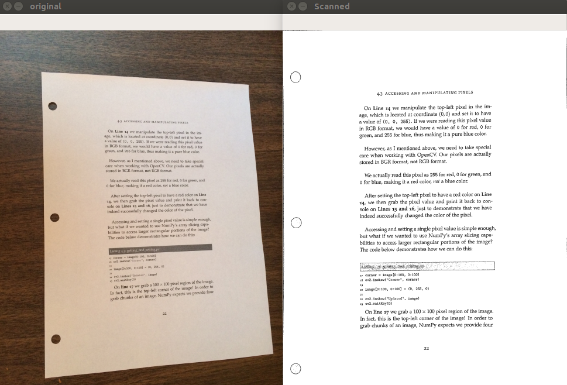

# documentScanner
  
    git clone https://github.com/dkhanna511/documentScanner.git
     
### 4pointTransform.py
Function to to perform four point tranform of an image and find out the rectangulare coordinates of the document and showing it by removing the unwanted backgrounf keeping only the page coordinates.
    
    python3 4pointTransform.py --image "path/to/image" --coords "x,y coordinates for rectangle"

### scanner.py
Python script for taking any input image and convert it into a black and white scanned document using fourPointTranformUtility.py
script as a utility function.

    python3 scanner.py --image "path/to/image"
    

    
